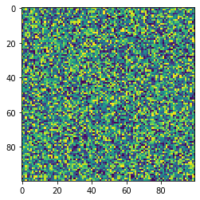
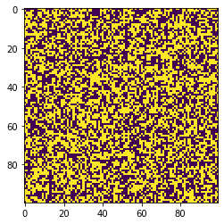

```python
import numpy as np
import matplotlib.pylab as plt
import seaborn as sns
```


```python
#Creating a 100x100 matrix with 100 columns and 100 rows containing random integers with max value of 100.

ary = np.random.randint(100, size=(100,100))  

#To show the dimensions I'll use the below code. 

ary.shape

# The number in the first position shows the row number while the number in the second position shows the column number.
```


    (100, 100)


```python
#To produce a heatmap of my 100X100 matrix, I have used plt.imshow().interpolation= 'nearest' option creates a heatmap with higher resolution.

plt.imshow(ary, interpolation= 'nearest')
plt.show()
```


    

    


```python
#To filter out the odd numbers (or select the even ones in other words), I created a logical vector that returns True for even numbers.

even = (ary % 2 == 0 )
print(even)

```

    [[False False False ...  True  True False]
     [ True False False ... False False False]
     [False  True  True ...  True False  True]
     ...
     [ True  True False ... False  True False]
     [ True  True  True ... False False  True]
     [False  True  True ... False  True False]]


```python
#If I want to see the numbers as they are, I need to use ary[even].

print(ary[even])
```

    [76 22 26 ... 10 14 96]


```python
#To convert the logical vector to integers, I have used .astype option and called it ary_even_int

ary_even_int = even.astype(int)
print(ary_even_int)

```

    [[0 0 0 ... 1 1 0]
     [1 0 0 ... 0 0 0]
     [0 1 1 ... 1 0 1]
     ...
     [1 1 0 ... 0 1 0]
     [1 1 1 ... 0 0 1]
     [0 1 1 ... 0 1 0]]


```python
ary.shape #Shape of my starting matrix.
```


    (100, 100)


```python
ary_even_int.shape #To show that the shape of the array is preserved.
```


    (100, 100)


```python
#To create the heatmap of my new array, I have used the below code.

plt.imshow(ary_even_int, interpolation='nearest')
plt.show()
```


    

    

